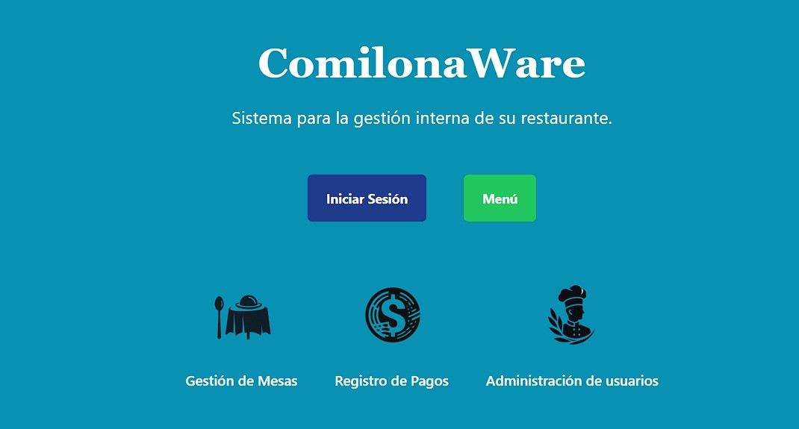
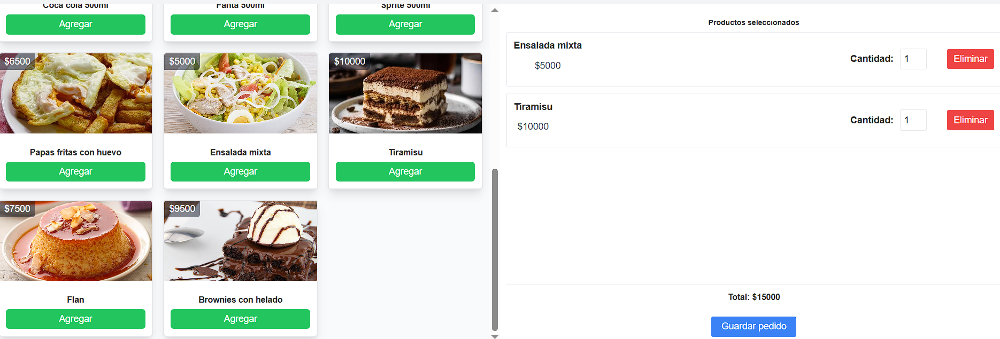

# comilonaware

El proyecto busca mejorar la gestión interna de un restaurante,
administrando los pedidos, pagos, productos, entre otros apartados.

Los usuarios tienen acceso a diferentes paneles dependiendo
de su rol dentro del restaurante.

Desarrollado en Laravel y React, utilizando MySQL y otras herramientas
como Tailwind y Bootstrap.

## Integrantes

| Nombre             | Github                                                   |
|:------------------:|:-------------------------------------------------------: |
| Nicolás Maldonado  | [Perfil de Github](https://github.com/nicodxlic)         |
| Marco Pistagnesi   | [Perfil de Github](https://github.com/elpista)           |